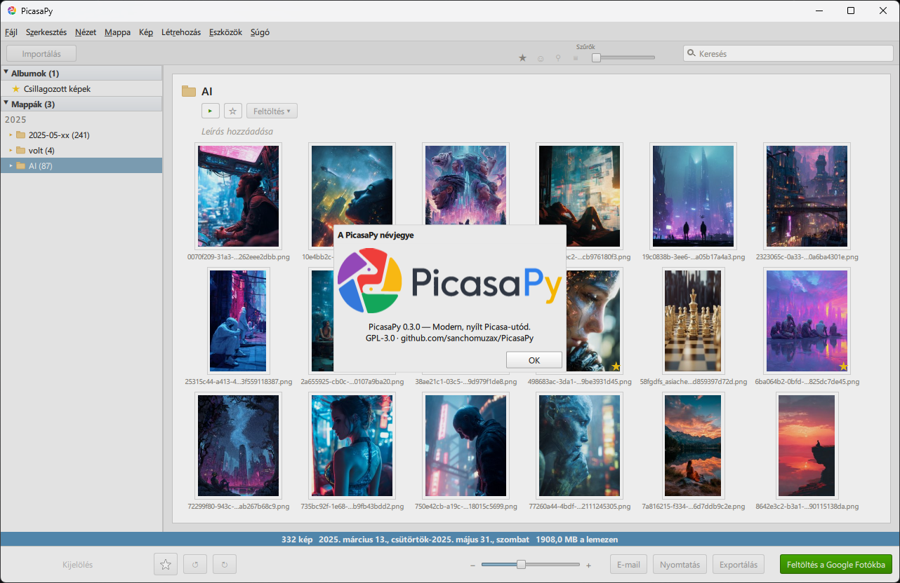

<p align="center">
  
</p>

<p align="center"><em>Google Picasa szellemében, modern Python/Qt alapokon.</em></p>

<p align="center">
  <a href="https://github.com/sanchomuzax/PicasaPy/actions/workflows/ci.yml"></a>
  <a href="LICENSE"></a>
  <a href="https://github.com/sanchomuzax/PicasaPy/releases"></a>
  
</p>

## Mi ez?

A PicasaPy a **Google Picasa** fotókezelő és -szerkesztő program nyílt forráskódú újraírása Python nyelven. A Picasát a Google 2016-ban kivezette, de sokan a mai napig használják gyors böngészés, csillagozás, feliratozás és nem-destruktív szerkesztés miatt. A PicasaPy célja egy modern, keresztplatformos utód, amely **kétirányúan kompatibilis** a Picasa `.picasa.ini` formátumával — így a régi és az új szoftver párhuzamosan, ugyanazon a fotótáron használható. Python nyelven, PySide6 (Qt 6) / QML felülettel készül; a fejlesztés Linux-first (Raspberry Pi 5-ön épül és tesztelődik), licence **GPL-3.0**. A projekt még **korai fejlesztési fázisban** van (0.x), messze az 1.0-tól — hibák és hiányzó funkciók még előfordulhatnak.

<p align="center">
  
</p>

---

## Fő képességek

A fejlesztés túllépett az 1. fázis (kezelő + néző) MVP-jén, és mélyen a 2.
fázisban (szerkesztő) jár. A ténylegesen kész funkciók fázisonként:

**Kezelő + néző (1. fázis)**

- **`.picasa.ini` byte-egzakt round-trip parser** — amit a PicasaPy nem ismer fel egy `.picasa.ini` fájlban, azt változtatás nélkül visszaírja. Ide tartozik a virtuális albumok (`[.album:…]` szekciók) round-trip olvasása/megőrzése is — böngésző UI-juk még nincs.
- **Mappa-bejárás (scanner)** a támogatott képformátumokra, watched-folders kezeléssel.
- **SQLite + FTS5 alapú index** a gyors kereséshez és szűréshez.
- **EXIF/IPTC metaadat-olvasás**, valamint **IPTC felirat (caption) írás** JPEG fájlokba.
- **Miniatűr-gyorsítótár (thumbnail cache)** OpenCV-vel.
- **PySide6/QML fő ablak**, Picasa-hű dizájnnal (rács nézet, csillagsáv, tálca).
- **Magyar lokalizáció.**
- **Egyképes néző (viewer)** léptetéssel, valamint **Időrend nézet** (év/hónap szerinti csoportosítás, Ctrl+5).
- **Csillagozás, nem-destruktív forgatás, felirat-szerkesztés.**
- **Többes kijelölés, szűrés, keresés.**
- **Import forrásból** (kártya/mappa beolvasása, dátum-alapú mappa-sablon, másolás vagy áthelyezés).
- **Meglévő Picasa-telepítés átvétele** (Wine-os/NAS-ra másolt `WatchedFolders.txt` felismerése és path-remap-elt átvétele).
- **Export** célmappába (forgatás és `filters=` lánc beégetésével, EXIF/IPTC-megőrzéssel).
- **XMP-export** sidecar fájlba (digiKam/Lightroom-kompatibilis).
- **Duplikátum-kezelő** (egzakt és hasonlósági keresés, nem-destruktív feloldás).

**Szerkesztő (2. fázis)**

- **Nem-destruktív szerkesztő munkamenet** (Visszaállítás, undo) a `.picasa.ini` `filters=` láncára építve.
- **20+ szűrő/effekt** (pl. autolight, autocolor, fill, finetune, unsharp, grain, vignette, glow, tint, sepia, bw, radblur/radsat, irányított tónusozás) — a teljes lista a render-motor kapcsolótáblájában (`src/picasapy/render/chain.py`).
- **Vágás (crop) átfedő eszközzel**, hisztogram, effekt-vágólap (másolás/beillesztés több képre).
- **PMP/db3 olvasó réteg** (PMP-oszlopok, thumbindex, deferredregion, path-remap) — tesztelt, de a tényleges *indexbe* import még nyitott (#1).

Azóta elkészült (a lista korábban ezeket még hiányzóként sorolta):

- **Retusálás és szöveg-eszköz** a szerkesztőben (#148).
- **Kollázs és mozgófilm készítés** (#29).
- **Geocímke: térkép-nézet és szerkesztés** (#30).
- **A Picasa 3.9-es effekt-fülei** dekódolva (#190).

Amit **még nem** tud:

- **Arcfelismerés** (#26) — a `.picasa.ini`-ben már meglévő arc-régiók (`faces=`) megjelennek a nézőben, de saját felismerést/`contacts.xml`-generálást a PicasaPy még nem végez.
- **PMP/db3-import az indexbe** (#1) — az olvasó réteg kész, a tényleges import még nem.
- **Sötét téma**: az alkalmazás **mindig világos**, ez tudatos döntés — a sötét téma a 3. fázis (V3) feladata.

## Állapot

⚠️ **Korai fejlesztési fázisban** van (a mindenkori verziót a fenti jelvény és a [Releases](https://github.com/sanchomuzax/PicasaPy/releases) oldal mutatja), messze az 1.0-tól. A projekt túl van az 1. fázis (kezelő + néző) MVP-jén, és mélyen a **2. fázisban** (nem-destruktív szerkesztő) jár. A formátum-kompatibilitás és az alapvető könyvtárkezelés stabil, de az API és a fájlformátum-részletek még változhatnak.

## Hogyan készült?

A fejlesztést alapos **formátum- és algoritmus-kutatás** előzte meg: NotebookLM-tudásbázis 30 forrással, referencia-repók auditja, valódi 140 ezer képes Picasa-adatbázison végzett validálás és „golden-image" mérések az eredeti Picasa 3.9-cel. A kutatás történetét és eredményeit — egy összefoglaló infografikával együtt — a [Hogyan készült a kutatás?](docs/research-story.md) dokumentum mutatja be.

## Telepítés és futtatás Linuxon

Debian/Raspberry Pi OS (trixie) rendszercsomagokkal ajánlott, mert a PySide6 és az OpenCV apt-csomagjai jól működnek RPi5-ön:

```bash
sudo apt install \
  python3-pyside6.qtcore python3-pyside6.qtgui python3-pyside6.qtqml \
  python3-pyside6.qtquick python3-pyside6.qtquickcontrols2 python3-pyside6.qtwidgets \
  python3-pyside6.qtmultimedia \
  python3-opencv python3-pil python3-piexif python3-watchdog \
  qml6-module-qtquick qml6-module-qtquick-controls \
  qml6-module-qtquick-layouts qml6-module-qtquick-templates qml6-module-qtquick-window \
  qml6-module-qtmultimedia
```

> **Videó-lejátszás:** a nézőbeli lejátszáshoz (#14) a `qml6-module-qtmultimedia`
> és a `python3-pyside6.qtmultimedia` csomag kell. Ha hiányzik, a PicasaPy
> attól még fut — a videóknál egy figyelmeztető szöveg jelenik meg a néző
> lejátszó-felülete helyett. (Pip-es telepítésnél a `PySide6` csomag ezt
> már tartalmazza; Linuxon a rendszer `libpulse0` csomagja is kell hozzá.)

```bash

git clone https://github.com/sanchomuzax/PicasaPy.git
cd PicasaPy
./picasapy ~/Kepek
```

## Futtatás Windowson

Windows-os támogatás **kísérleti** — a fejlesztés Linuxon (RPi5) folyik, de a tesztkészletet a CI Windowson is futtatja.

1. Telepíts Python 3.12+-t a [python.org](https://www.python.org/) oldalról.
2. Telepítsd a függőségeket:

   ```powershell
   pip install PySide6 opencv-python pillow piexif watchdog
   ```
3. Klónozd a repót, majd indítsd:

   ```powershell
   git clone https://github.com/sanchomuzax/PicasaPy.git
   cd PicasaPy
   python picasapy C:\Kepek
   ```

## Tesztek futtatása

A teljes tesztkészlet **egyetlen** `pytest`-processzben futtatva Qt/GIL-
deadlockba ragadhat (#53, #155) — ezért a darabolt `scripts/run_tests.py`
az elsődleges út: a nem-Qt teszteket egy processzben, a `tests/app` alatti
QML-teszteket pedig fájlonként, külön processzben, kemény timeouttal
futtatja, így egy beragadó fájl sem viszi el az egész futást.

Linuxon és Windowson (PowerShell) egyaránt:

```bash
pip install pytest pytest-cov
python scripts/run_tests.py
```

Lefedettség-összesítővel (#300):

```bash
python scripts/run_tests.py --cov
```

Gyors, célzott ellenőrzéshez (nem a végső, teljes futás helyett) a nem-Qt
tesztek közvetlenül, egy processzben is futtathatók:

```bash
python3 -m pytest tests --ignore=tests/app -q
```

Megjegyzések Windowshoz:

- Fej nélküli környezetben (pl. CI, távoli shell) a Qt-nek offscreen platform
  kell: `$env:QT_QPA_PLATFORM = "offscreen"`.
- Két teszt platform-okokból kimarad (skip): a POSIX-jogosultságokra épülő
  chmod-tesztek Windowson nem értelmezhetők.
- A törött-symlink teszt jogosultság híján (se Developer Mode, se admin)
  szintén skippel — ez normális, nem hiba.

## Hordozhatósági tanulságok (Windows)

A tesztkészlet Linuxon és Windowson is fut (CI: `ubuntu-latest` +
`windows-latest`). A port közben rögzített szabályok:

- **Atomikus fájlcsere:** az `os.replace()` Windowson is atomikus, ezért az
  `.picasa.ini`-írás (temp fájl + csere) mindkét platformon biztonságos. A
  könyvtár-fsync viszont csak POSIX-on lehetséges — Windowson kihagyjuk
  (`src/picasapy/ini/io.py`).
- **`chmod` szemantika:** Windowson a `chmod` csak a read-only bitet kezeli,
  a `chmod(0)` nem tesz olvashatatlanná egy fájlt. A jogosultság-alapú
  tesztek ezért `os.name == "posix"` skip-markert vagy `os.access()`-őrt
  használnak.
- **Symlink jogosultsághoz kötött:** Windowson symlinket csak Developer
  Mode-dal vagy adminként lehet létrehozni — a symlinkes tesztek `OSError`
  esetén skippelnek, sosem buknak emiatt.
- **Útvonal-szeparátor:** minden útvonal-hasítás a `[/\\]` regexszel vagy
  `pathlib.Path`-szal történik; `"/"`-re string-splitelni tilos. A QML felé
  `QUrl.fromLocalFile()` adja a `file://` URL-t (Windowson `file:///C:/…`).
- **Qt offscreen:** a CI mindkét lábon `QT_QPA_PLATFORM=offscreen`-nel fut,
  így a QML-tesztek kijelző nélkül is működnek.
- **Fájlfigyelés:** a `watchdog` Windowson más backendet használ
  (`ReadDirectoryChangesW`), az eseménysorrend eltérhet — a figyelő-tesztek
  eseményre várnak (timeoutos `Event.wait`), nem fix időzítésre építenek.
- **OpenCV:** CI-ban az `opencv-python-headless` csomag kell (GUI-függőségek
  nélkül); asztali gépen a sima `opencv-python` is jó.

## Architektúra röviden

- `src/picasapy/ini/` — a `.picasa.ini` fájlformátum parsere és írója (round-trip elv).
- `src/picasapy/scanner/` — mappa-bejárás, figyelt mappák, támogatott fájltípusok.
- `src/picasapy/index/` — SQLite + FTS5 index, sémakezelés, szinkronizáció.
- `src/picasapy/metadata/` — EXIF/IPTC olvasás és IPTC felirat-írás.
- `src/picasapy/thumbs/` — miniatűr-gyorsítótár OpenCV-vel.
- `src/picasapy/edit/` — nem-destruktív szerkesztő munkamenet (session, mentés, Visszaállítás).
- `src/picasapy/render/` — a `filters=` lánc szűrőinek/effektjeinek render-motorja.
- `src/picasapy/export/` — export célmappába és XMP sidecar-export.
- `src/picasapy/dedup/` — duplikátum-kereső (egzakt és hasonlósági).
- `src/picasapy/pmpimport/` — PMP/db3 olvasó réteg (a tényleges indexbe-import nyitott, #1).
- `src/picasapy/app/` — PySide6/QML alkalmazás (kontroller, modellek, QML nézetek, lokalizáció).

## Kompatibilitás

- **`.picasa.ini`**: csillag, forgatás, felirat, szűrők (filters mátrix) és virtuális albumok round-trip olvasása és írása, Picasa 3.x formátumban.
- **IPTC felirat**: JPEG fájlokba beírt IPTC caption mező kezelése.
- **XMP**: fotónkénti sidecar-export (digiKam/Lightroom-kompatibilis).
- **PMP/db3**: az olvasó réteg (PMP-oszlopok, thumbindex, deferredregion, path-remap) kész és tesztelt; a tényleges *indexbe* import még nyitott (#1).

## Verziózás

A projekt [Semantic Versioning](https://semver.org/)-t követ. A `0.x` verziók **instabilak**, a köztük lévő API- és formátum-változások nincsenek garantálva visszafelé kompatibilisnek. Lásd a [Releases](https://github.com/sanchomuzax/PicasaPy/releases) oldalt.

## Licenc

[GPL-3.0](LICENSE) — szabadon megosztható és módosítható; a GPL-es referencia-repókból portolt kódrészletek attribúcióval szerepelnek.

## Köszönet

Köszönet az eredeti **Google Picasa** csapatának a program megalkotásáért — a PicasaPy dizájn-referenciája a **Picasa 3.9**.
